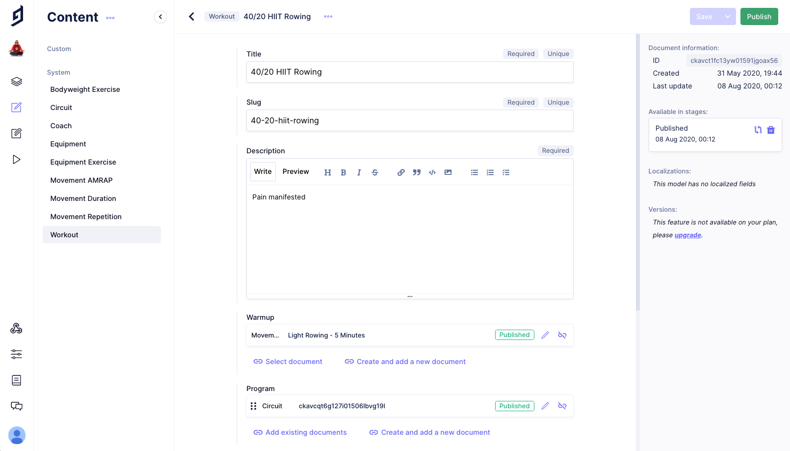
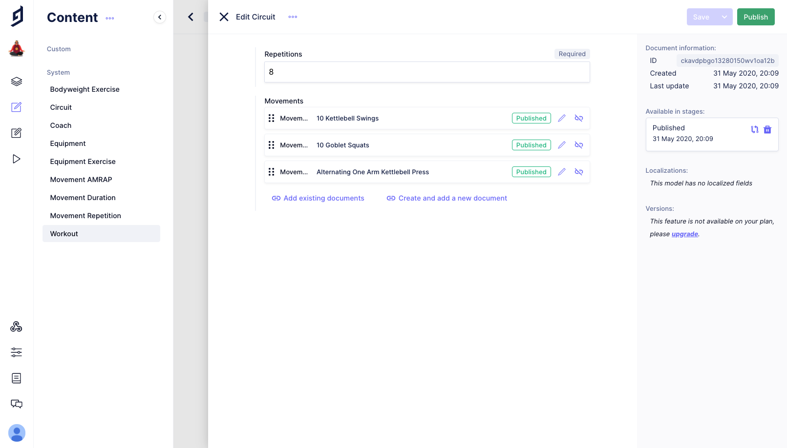

# Hasura Fit: Setting up GraphCMS

In this portion of the multi-part tutorial, we’ll be creating our data model that acts primarily as our product information manager. Since the product being offered is a complex content structure at the end of the day, GraphCMS is the perfect tool for this job.

## Why GraphCMS?

The most important reason why we chose GraphCMS is because the author works there. Ok, full disclosures out of the way, GraphCMS is one of the fastest methods out there to create a hosted GraphQL API. By simply clicking together models and types you can create complex relationships, including the often verbose “many-to-many” relationships within seconds.

GraphCMS also lets us have a content editing backend where our theoretical marketing team would be able to update the product info (our product being workout programs) and be able to update our application’s content without needing the traditional heightened access controls like accessing a user database would entail.

This is our separation of concerns between Hasura and GraphCMS - Hasura handles our user data and GraphCMS handles our product data.

The last reason we are using GraphCMS, and one of the core USPs of GraphCMS, is that it supports GraphQL mutations as well! This means that we can write data back into our content model. This is helpful because from our application data hooks, whenever a user completes a workout, we are able to simply update an integer of “popularity” on one of our workout programs so that we have a pre-compiled analytics for sorting these workouts later without the need to worry about secure and costly aggregation of our entire user database when our front-end team simply wants to sort which workouts are the most popular.

## Environment Variables in GraphCMS

GraphCMS doesn’t have environment variables per se but it does have permanent auth tokens which we’ll use to authorize access to our API. Particularly because of our mutation API, it’s important to separate who has access to mutate our content vs who has access to just read our content. We can also separate access to draft vs published content in the situation where you have a preview environment.

## Creating the Content Model

We’ll be doing most of our fancy content modeling in GraphCMS. Our content model will be taking advantage of a number of content modeling concepts such as composition, extending base types and creating union relationships of one or more types.

I’d like to invent a term with you called “SCUR” - this idea is not new but let’s give it a name. SCUR stands for “smallest composable unit, reasonable”. What this means is that we should try to break our content model into the smallest entry we possible can within reason balancing the concerns of time, resource and maintainability.

My model has the following primitives: A base workout type, say, a pushup. We extend on that with composition to create different types of this workout, pushup exercises that are a function of time (5 second count), pushups that are a function of repetition (25 pushups) and pushups that are a function of endurance (AMRAP - as many reps as possible, usually within a minute). Later if I want to identify the average caloric value of an exercise or some kind of additional data to my base exercise type, I can do that without the need to update a bunch of locations.

Additionally, our base workout is also one of two types, either a body weight exercise which can be done with just your own body’s weight or an exercise dependent on equipment such as boxing or jump-roping.

Another type we have is a set, or a grouping of exercises together that require some kind of order. Since these could be a mixture of time exercises, repetition exercises or AMRAP exercises, and even sub-sets, we need to use a union type relation that lets us define the possibility of any of these valid inputs.

These sets, mixed with warmups (also a union type to our exercise matrix) and cool-downs (also a union type) along with some content description, images and more create the full exercise protocol or programming and a complete product in our system.

And now our content model from GraphCMS is complete!

Next: [Set up Auth0](hasura-fit-setting-up-auth0.md)
